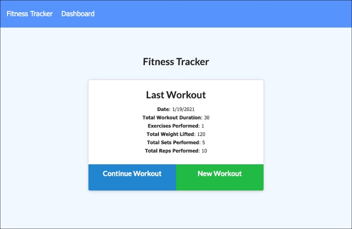
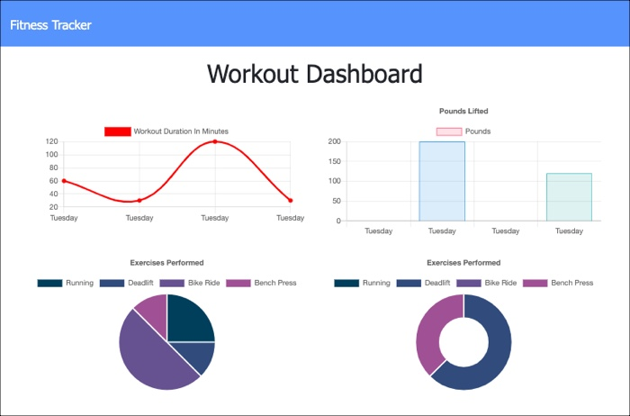

# Workout Tracker

## Table of Contents

[Description](#description)  
[User Story](#user-story)  
[Business Context](#business-context)  
[Technologies Used](#technologies-used)  
[Links](#links)  
[Screenshots](#screenshots)  
[License](#License)

## Description

A web-based workout tracker application that utlizes a Mongo database with a Mongoose schema, and handles routes with Express.

## User Story

- As a user, I want to be able to view create and track daily workouts.
- I want to be able to log multiple exercises in a workout on a given day.
- I should also be able to track the name, type, weight, sets, reps, and duration of exercise.
- If the exercise is a cardio exercise, I should be able to track my distance traveled.

## Business Context

A consumer will reach their fitness goals more quickly when they track their workout progress.

## Technologies Used

- HTML
- CSS
- JavaScript
- Express
- Heroku
- MongoDB
- Mongoose
- morgan

## Links

GitHub Repository: https://github.com/MeganCarnaghi/Workout-Tracker.git

Deployed Application: https://stormy-sea-35161.herokuapp.com/stats

## Screenshots

## License

